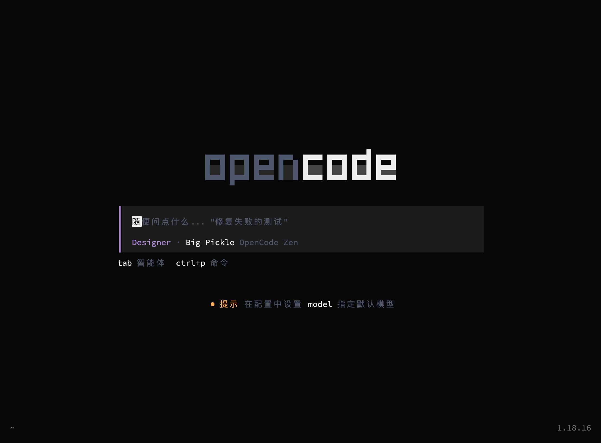

# opencode-zh — OpenCode CLI 简体中文汉化

[](LICENSE)
[-lightgrey.svg)](#)
[](#)

> 一个 **Claude Code skill**：把 opencode（terminal AI coding agent）的 CLI/TUI 界面
> 汉化为简体中文。**版本号严格跟随官方**，只做 UI 汉化，不碰模型配置与 AI 行为。



## 这是什么

- **汉化包**：44 个 JSON 规则集（覆盖对话框、命令面板、侧边栏、快捷键提示等全部主要界面）
- **一键汉化**：`bash scripts/localize.sh` 自动完成 下载源码 → 迁移配置 → 应用 → 甄别 → 构建 → 部署
- **AI 友好**：整个仓库是一个 skill（`SKILL.md` 为唯一入口），任何 AI agent 按它即可独立完成汉化
- **版本跟随**：汉化版 `opencode --version` 显示官方版本号（当前 v1.18.16），不发明自己的版本号

## 安装为 skill

```bash
# 方式一：克隆后作为 skill 使用（需 Claude Code）
git clone https://github.com/jiangnanquan/opencode-zh.git ~/.claude/skills/opencode-zh
# 之后对话中可直接用 /opencode-zh 触发

# 方式二：本地直接使用（不依赖 Claude Code）
git clone https://github.com/jiangnanquan/opencode-zh.git
cd opencode-zh
bash scripts/build-tool.sh   # 编译汉化工具（需 go）
bash scripts/localize.sh     # 一键汉化并部署
```

## 快速使用

```bash
# 更新汉化版（官方发布新版后）
bash scripts/localize.sh

# 部署后运行
opencode
```

汉化版部署在 `~/.opencode/bin/opencode`（自动重新签名，兼容 macOS 26）。

## 项目结构

```
opencode-zh/                  ← skill 根目录
├── SKILL.md                  ★ 唯一入口（AI agent 读它即可完成全部工作）
├── opencode-i18n/            ★ 汉化包（44 个 JSON 规则集）
├── scripts/
│   ├── localize.sh           ★ 一键全流程
│   ├── migrate_i18n.py       配置增量迁移（官方更新后重定位规则）
│   ├── check-misreplacements.sh  误伤甄别（红线扫描）
│   ├── deploy.sh             部署 + 代码签名
│   └── build-tool.sh         编译汉化工具
├── SOP.md                    参考手册（格式规范、环境备忘、排查指南）
└── PITFALLS.md               踩坑记录与故障排查
```

## 限制与通用性

- **汉化包与全部文档平台无关**：任何操作系统上的 agent 都能维护配置、执行误伤甄别
- **构建产物**：当前脚本产出 macOS Apple Silicon（darwin-arm64）——这是本仓库的默认目标；
  其他平台（linux-x64 等）只需修改 `scripts/localize.sh` 中的 `--platform` 参数即可，
  但需自行验证构建工具链兼容性
- 汉化覆盖 CLI/TUI 主要界面；命令描述等次要文本可能未全覆盖（欢迎 PR 补充）
- 模型名与专有概念（如 Warp）按约定不汉化

## 关联项目

- [opencode](https://github.com/anomalyco/opencode) — 被汉化的官方项目
- [OpenCodeChineseTranslation](https://github.com/1186258278/OpenCodeChineseTranslation) — 早期社区汉化项目（2026-03 起停更，配置已迁移到本项目）
